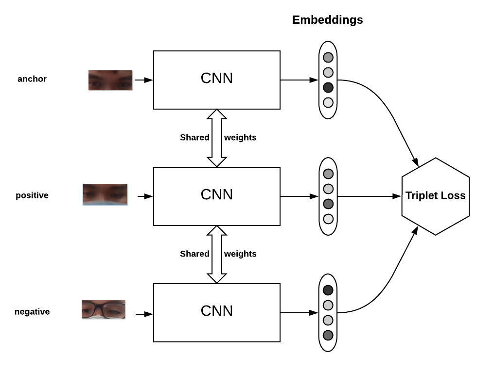

#  MASKED FACE RECOGNITION
## Deep Learning Based Masked Face Recognition Using Triplet Loss 
### Getting started

Triplet loss is a loss function for machine learning algorithms where a baseline (anchor) input is compare 
to a positive (truthy) input and a negative (falsy) input. The distance from the baseline (anchor) input to 
the positive (truthy) input is minimized, and the distance from the baseline (anchor) input to 
the negative (falsy) input is maximized.For more details, you can refer to this [paper](https://arxiv.org/pdf/1503.03832.pdf)

### Architecture

